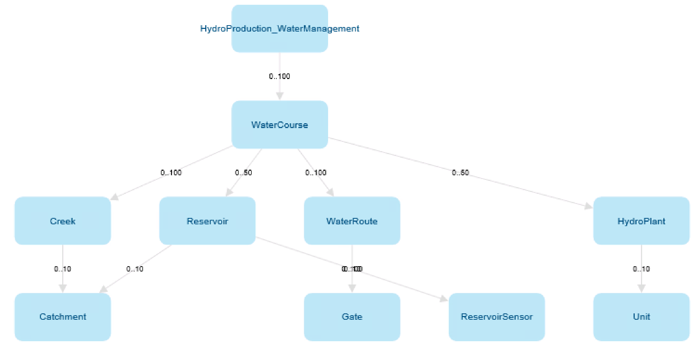
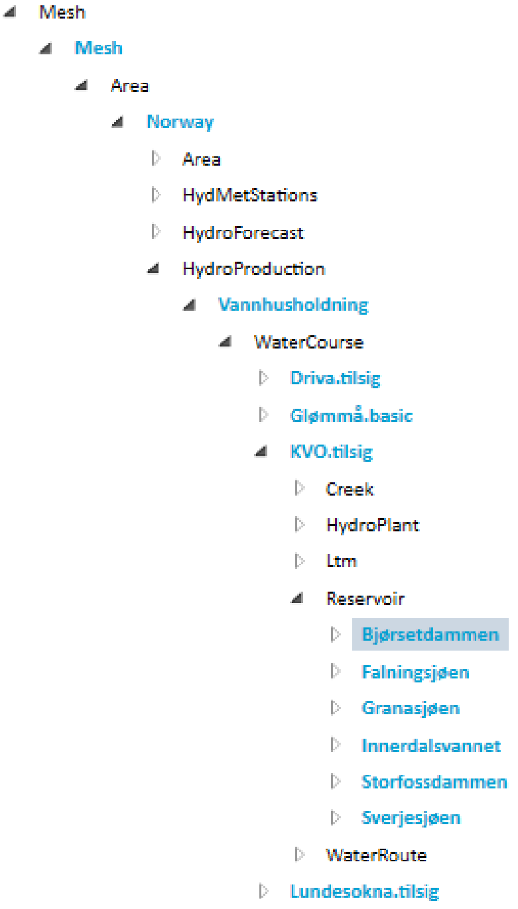

Mesh concepts
---------------------------

The **mesh object model** is designed to represent the physical infrastructure of a customers area and assets. This can be a hydropower production system with water courses, creeks, reservoirs, waters routs, gates, sensors, hydro plants and so on. The mesh object model represents relationships, :doc:`attributes (aka properties) <attributes>` and collected data on these assets. A relationship can represent how a water course is connected to a creek, data can be the water level in a reservoir collected over time and a property can be the unit of measurement for this water level.

Based on the mesh object model, a customer can build a **physical model** of their infrastructure by creating instances matching their specific assets. For example water courses named 'Driva', 'Lundesokna', reservoirs named 'Innerdalsvannet', 'Storfossdammen' and so on. The resulting **model** is a tree where all the nodes are mesh objects from the mesh object model that represent a physical assets of a customer.

The primary data in mesh is :doc:`time series <timeseries>`. A time series is a sequence of data points that occur in successive order over some period of time. They can represent different kinds of data depending on its properties. How much power a hydro plant generates at any given time can be represented as a time series and so can how much water passes a gate per hour.

Mesh comes with a :doc:`search language <search>` which is used to travers the mesh object model. One might want to find the water level for all reservoirs in a specific area in a given time interval. To be able to search for something in the mesh object model one needs to define a mesh object to starting searching from and the criteria for the objects one wants to find. The criteria can be defined using a specific **search syntax**.

Mesh provides :doc:`functions <functions>` used to perform tasks and calculations on data in the mesh object model. There are a wide range of functions available which can perform tasks like summing all values in a time series, find values and status for a timeseries at a given historical time, transform time series values from one resolution to another and many more. These functions are loosely arranged into groups representing a theme for those functions.

.. toctree::
   :hidden:

   attributes
   timeseries
   search
   functions

.. Comment
    - mesh model, concepts
        - objects with relationships mimicking a customer physical model
        - mesh concepts guide
        - search language
            - syntax
        - calculation functions
            - statistical
            - history

