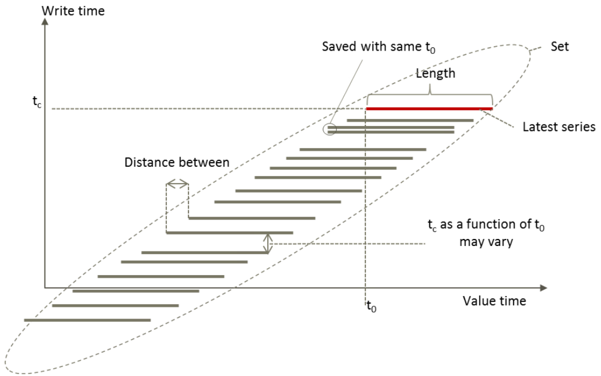
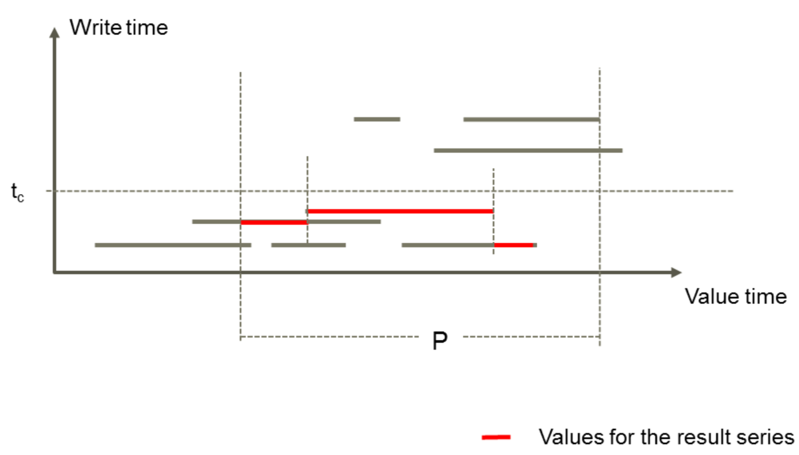

Mesh functions
---------------

.. _mesh expression:

**Expressions** can be used to access **functions** available in Mesh. The result of a calculation based on a function is a temporary time series, i.e. a time series which is not in the database. Every time the calculation expression is run, values are calculated for the temporary time series. However, the result is only available when the Mesh session is open.

The Mesh :doc:`search language <mesh_search>` can be used with functions to find specific objects to work on.

Definition of a Mesh function
~~~~~~~~~~~~~~~~~~~~~~~~~~~~~~~~~~~

Functions are identified with a name and an unprotected identifier, and are distinguished from variables by the first character: an @-symbol. The same function name can have several argument combinations.

The function's argument is placed in parenthesis ( ). A function can have any number of arguments, including 0.

Example showing expressions made using functions:

- Expression A equals a number
    - A = 5
- Expression B equals the result of the sum of two MAX functions using expression A and the max value in time series EnTS
    - B = @MAX(A, 55) + @MAX(%EnTS)

Valid result types from functions:

- Single time series
- Array of time series
- Single double value
- Array of double values
- Single string value
- Array of string values

Forecast
~~~~~~~~~~~~~~

A forecast is a calculation or estimate of future events, especially coming weather or a financial trend.

Every grey line in the image below represents a forecast of some time series. Start and end times are given on the horizontal axis, while the vertical axis show every forecasts write time.

.. automodule:: volue.mesh.calc.forecast
   :noindex:

The above class is exposed via:

.. automethod:: volue.mesh._connection.Connection.Session.forecast_functions
   :noindex:

.. automethod:: volue.mesh.aio._connection.Connection.Session.forecast_functions
   :noindex:

History
~~~~~~~~~~~~~~

Historical values are not overwritten when saving new values. The figure below shows a time series having values with various write times. When asking for historical values before a given time (t\ :sub:`c`) the values indicated by red is returned.

.. automodule:: volue.mesh.calc.history
   :noindex:

The above class is exposed via:

.. automethod:: volue.mesh._connection.Connection.Session.history_functions
   :noindex:

.. automethod:: volue.mesh.aio._connection.Connection.Session.history_functions
   :noindex:

Statistical
~~~~~~~~~~~~~~

Functions for performing statistical operations on time series.

.. automodule:: volue.mesh.calc.statistical
   :noindex:

The above class is exposed via:

.. automethod:: volue.mesh._connection.Connection.Session.statistical_functions
   :noindex:

.. automethod:: volue.mesh.aio._connection.Connection.Session.statistical_functions
   :noindex:

Transform
~~~~~~~~~~~~~~~

The functions in this category are used to transform a time series from one resolution to another.

.. automodule:: volue.mesh.calc.transform
   :noindex:

The above class is exposed via:

.. automethod:: volue.mesh._connection.Connection.Session.transform_functions
   :noindex:

.. automethod:: volue.mesh.aio._connection.Connection.Session.transform_functions
   :noindex:
