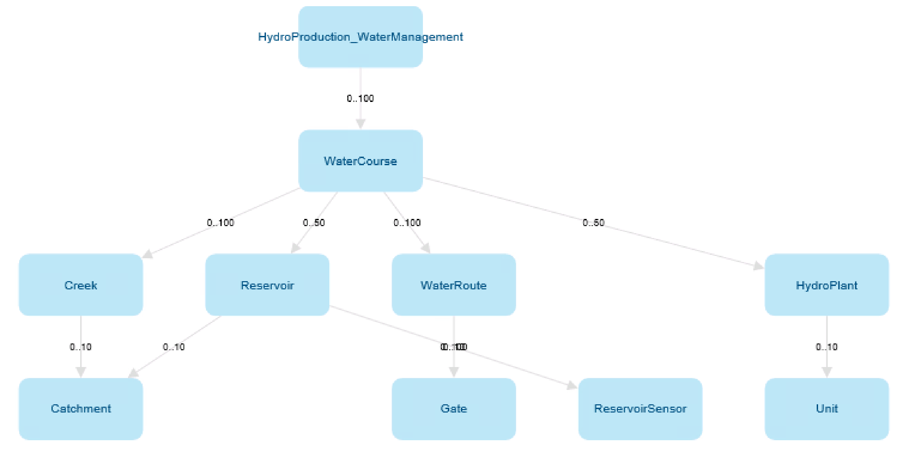

======================
Mesh object modelling
======================

Mesh is a data management system based on object modelling.
Real world objects are represented in Mesh using the following concepts:

* models and model definitions
* objects and object definitions
* attributes and attribute definitions

From high-level view there are model definitions that consist of one or more
object definitions. Each object definition consists of one or more attribute
definitions. The definitions serve as *blueprints* and can be instantiated.
Instances of the definitions are just called: models, objects and attributes.

For example we could have a model definition called *EnergySystem* that has
object definition called *PowerPlant* that has two attribute definitions:

* *NumberOfWindTurbines* of integer type
* *PowerProduction* time series

Such definitions could be instantiated and so we could have: model called
*MyEnergySystem* that has three objects:

* *PowerPlantA* with *NumberOfWindTurbines* = 5
* *PowerPlantB* with *NumberOfWindTurbines* = 10
* *PowerPlantC* with *NumberOfWindTurbines* = 3

.. _mesh_model_definition:

Model definition
*****************

The **Mesh model definition** is designed to represent the physical
infrastructure of a customer's area and assets. This can be a hydropower
production system with water courses, creeks, reservoirs, water routes,
gates, sensors, hydro plants and so on. The Mesh model definition consists of
:ref:`object definitions<mesh_object_definition>` and
:ref:`attribute definitions <mesh_attribute_definition>` of different types.
Each asset type is represented by a **Mesh object definition**.

.. _mesh_object_definition:

Object definition
*******************

Consists of :ref:`attribute definitions <mesh_attribute_definition>` of
different types. Object definition could be compared to a C++ class.

For example: an object definition could represent a water course. It can have
an attribute definition that represents current water level in a reservoir and
a relationship attribute definition that represents how this water course is
connected to some creek.

.. _mesh_attribute_definition:

Attribute definition
**********************

Attribute definition may be singular or an array of one of the following types:

* self-contained simple type, like: string, boolean, int, double or UTC
  timestamp.
* time series attribute, it can be a calculation or a reference to
  a physical time series or virtual time series
* relation to other object definition

Each attribute definition has:

* ID
* name
* description
* value type, e.g.: double attribute or time series attribute
* minimum and maximum cardinality, useful for definitions of an array type
  (e.g. array of boolean), for singular definitions they are always set to 1

Additionally specific attribute definitions may have additional fields, e.g.:
time series attribute definition has *template expression* and relationship
attribute definition has *object type*.

Attribute definition could be compared to a C++ class member.

.. _mesh_model:

Model
**********

Based on the Mesh :ref:`model definition <mesh_model_definition>`, customers
can build a **model** of their infrastructure by creating instances matching
their specific assets. For example water courses named 'Driva', 'Lundesokna',
reservoirs named 'Innerdalsvannet', 'Storfossdammen' and so on. The resulting
**model** is a tree where all the nodes are Mesh objects from the Mesh model
that represent customer's physical assets.

.. image:: images/physical_hydropower_object_structure.png
   :width: 400

In the diagram above object names are written in blue, object value types are
written in black and there are no attribute shown.

.. _mesh_object:

Object
**********

Mesh object consists of :ref:`attributes <mesh_attribute>`. Object is an
instance of an :ref:`object definition <mesh_object_definition>`.

Objects are identified by IDs or paths, refer to
:ref:`objects and attributes paths <mesh_object_attribute_path>`
for more information.

.. _mesh_attribute:

Attribute
**********

Attribute is an instance of
:ref:`attribute definition <mesh_attribute_definition>`. Attribute consists of
a **definition** (inherited from **attribute definition**) and possibly
a **value** of some type.

Some of the Mesh attribute types are grouped in the Mesh Python SDK for better
readability. Here is a list of all attribute types currently supported:

* **Simple attributes** - all of them have value(s) (defined on attribute level) and
  default value (defined on the attribute definition level). They are
  aggregating the following types:

  - Double attribute - additionally it has minimum value, maximum value and
    unit of measurement (defined on the attribute definition level).

    Definition value types are "DoubleAttributeDefinition" for singular value
    or "DoubleArrayAttributeDefinition" for collection of values.

  - Integer attribute - additionally it has minimum value, maximum value and
    unit of measurement (defined on the attribute definition level).

    Definition value types are "Int64AttributeDefinition" for singular value
    or "Int64ArrayAttributeDefinition" for collection of values.

  - Boolean attribute - definition value types are "BooleanAttributeDefinition"
    for singular value or "BooleanArrayAttributeDefinition" for collection of
    values.

  - String attribute - definition value types are "StringAttributeDefinition"
    for singular value or "StringArrayAttributeDefinition" for collection of
    values.

  - UTC time attribute- additionally it has minimum value and maximum values
    (defined on the attribute definition level).

    The default, minimum and maximum value for this attribute is a string,
    where you can use expressions like: "UTC20220510072415".

    Definition value types are "UtcDateTimeAttributeDefinition" for singular
    value or "UtcDateTimeArrayAttributeDefinition" for collection of values.

* **Time series attributes** - they can be a:

      - reference to a physical time series: it has actual data (timestamps,
        values and flags) and meta data (e.g.: curve type, resolution, etc.).

      - reference to a virtual time series: it has defined an expression to
        calculate time series data (similar to calculation time series).

      - calculation time series: it has defined an expression to calculate
        time series data. The calculation expression can be defined on the
        attribute definition level (then it is a *template expression*) or
        overwritten for the given attribute in the model (then it stored as
        *local expression*).

  Definition value types are "TimeseriesAttributeDefinition" for singular value
  or "TimeseriesCollectionAttributeDefinition" for collection of values.

* **Relationship attributes** - connect two objects. The owned object's owner
  is always a relationship attribute that belongs to some other object. There
  are two types of relationship attributes:

    - one-to-one
    - one-to-many

  When creating a new object the owner must be a relationship attribute
  of one-to-many type. Relationship attribute has defined *object type*
  (on the attribute definition level) that shows what object value type
  is accepted to be added as child.

  Definition value types are "ElementAttributeDefinition" for singular value or
  "ElementCollectionAttributeDefinition" for collection of values.

.. note::

  The definition value types are useful for filtering attribute search results.
  For example to list only time series attributes. They are also useful for
  checking accepted object value types (in relationship attributes) when
  creating new objects.

Attributes are identified by IDs or paths, refer to
:ref:`objects and attributes paths <mesh_object_attribute_path>`
section for more information.

.. _mesh_object_attribute_path:

Objects and attributes paths
****************************

Objects and attributes are identified by IDs or paths. Path is a string
uniquely identifying an object in the model and consists of all ancestors of
a given object and optionally their relationship attributes.

For example the path for the *Innerdalsvannet* reservoir from example diagram
in :ref:`model <mesh_model>` (object names are written in blue) is::

  Model/Mesh/Norway/Vannhusholdning/KVOtilsig/Innerdalsvannet

This is a path where only objects are provided. A path where also relationship
attributes that connect those objects are provided is called full name.
For the same *Innerdalsvannet* reservoir the full name path is::

  Model/Mesh.To_Areas/Norway.To_HydroProduction/Vannhusholdning.To_WaterCourses/KVOtilsig.To_Reservoirs/Innerdalsvannet

As you can see the attributes are provided after objects and a *dot* "."
character. For example full name path for an attribute of the
*Innerdalsvannet* reservoir is::

  Model/Mesh.To_Areas/Norway.To_HydroProduction/Vannhusholdning.To_WaterCourses/KVOtilsig.To_Reservoirs/Innerdalsvannet.MaxVolume

Every path in Mesh model starts with *Model/* prefix.

.. note::

  Mesh Python SDK library returns always full names as path when reading
  objects or attributes.
