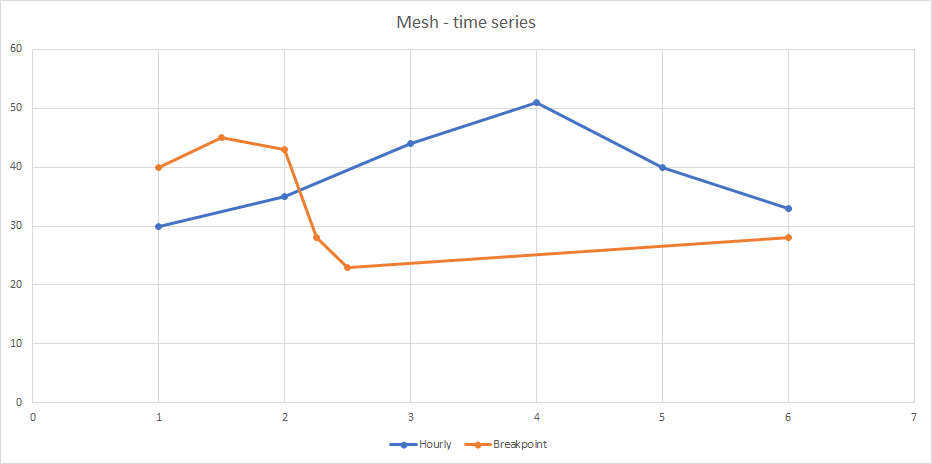

Time series
***************

The primary data retrieved from the Mesh server is time series. A time series is one or more points in chronological sequence.

Each point in the time series contains the following fields:

* `utc_time`:
    - timestamp of the point (milliseconds since UNIX epoch 1970-01-01) in UTC
* `flags`:
    - status flag, 32-bit flags providing extra information like: is the point value correct or missing
    - See: :py:meth:`volue.mesh.Timeseries.PointFlags`
* `value`:
    - double-precision floating point value of the point

Time series can contain large amounts of data. A common scenario is to retrieve time series and process the data. That could mean copying or moving all the data from one library to another, this can be both time consuming and memory intensive. To alleviate these problems the Mesh Python SDK uses `Apache Arrow <https://arrow.apache.org/>`_ to store the data. Apache Arrow "is designed to both improve the performance of analytical algorithms and the efficiency of moving data from one system or programming language to another". [#]_
Several data processing libraries are now supported for this format, including `numpy <https://arrow.apache.org/docs/python/numpy.html>`_ and `pandas <https://arrow.apache.org/docs/python/pandas.html>`_.

Time series can be either raw or derived. *Raw time series* are store in a resource layer as points with timestamps, flags and values. All *raw time series entries* (see: :py:meth:`volue.mesh.proto.core.v1alpha.core_pb2.TimeseriesEntry`) have a time series key, a path (in the resource layer), a curve type, a resolution and a unit of measurement.

The resolution defines time step of the time series points. Some examples are hourly or daily resolutions. A special type of resolution is **breakpoint**. It means there is no time step restriction and points can be provided for any timestamps.

A raw time series can be connected to a Mesh model either directly or as part of a calculation. A time series that is in the Mesh model have metadata like a path (in the Mesh model), a local and template expression and possibly a link to a raw time series entry. (see: :py:meth:`volue.mesh.proto.core.v1alpha.core_pb2.TimeseriesAttribute`)

.. rubric:: Footnotes

.. [#] `<https://arrow.apache.org/overview/>`_
